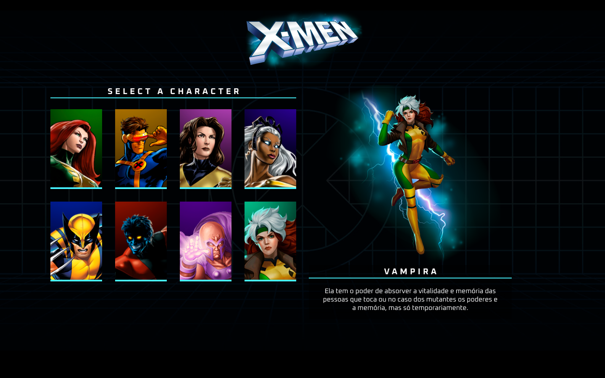

  

  

## 🖥️ Projeto
Esse é um projeto web Responsivo que possibilita selecionar os personagens do X-men e vizualizar seu perfil

## 🚀 Tecnologias
Esse projeto foi desenvolvido durante o evento Do Zero ao Programador Contratado do Dev em Dobro com as seguintes tecnologias: 

- HTML
- CSS
- JS
- Git e Github

## 🏷️ Layout 
Você pode visualizar o layout do projeto através 
[desse link](https://www.figma.com/file/pcXaFvQGmgvIVwTAtfbzCc/Dev-em-Dobro?type=design&node-id=54-1565&mode=design&t=6dqA1b1VmlZuvllt-0).

# É necessário ter uma conta no [Figma](https://www.figma.com)
